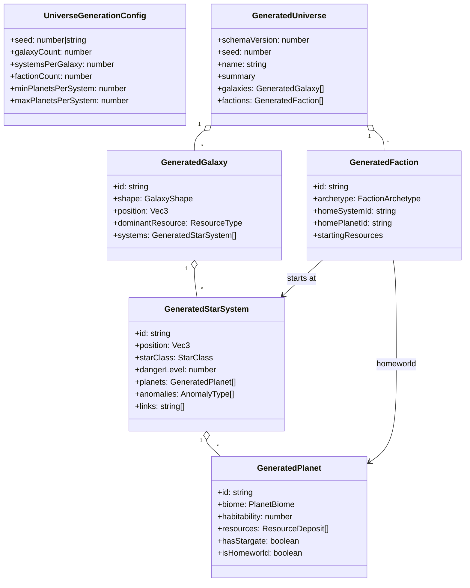
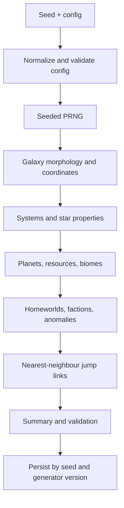

# Procedural Universe — UML

## Class / data model

```mermaid
classDiagram
  class UniverseGenerationConfig {
    +seed: number|string
    +galaxyCount: number
    +systemsPerGalaxy: number
    +factionCount: number
    +minPlanetsPerSystem: number
    +maxPlanetsPerSystem: number
  }
  class GeneratedUniverse {
    +schemaVersion: number
    +seed: number
    +name: string
    +summary
    +galaxies: GeneratedGalaxy[]
    +factions: GeneratedFaction[]
  }
  class GeneratedGalaxy {
    +id: string
    +shape: GalaxyShape
    +position: Vec3
    +dominantResource: ResourceType
    +systems: GeneratedStarSystem[]
  }
  class GeneratedStarSystem {
    +id: string
    +position: Vec3
    +starClass: StarClass
    +dangerLevel: number
    +planets: GeneratedPlanet[]
    +anomalies: AnomalyType[]
    +links: string[]
  }
  class GeneratedPlanet {
    +id: string
    +biome: PlanetBiome
    +habitability: number
    +resources: ResourceDeposit[]
    +hasStargate: boolean
    +isHomeworld: boolean
  }
  class GeneratedFaction {
    +id: string
    +archetype: FactionArchetype
    +homeSystemId: string
    +homePlanetId: string
    +startingResources
  }
  GeneratedUniverse "1" o-- "*" GeneratedGalaxy
  GeneratedGalaxy "1" o-- "*" GeneratedStarSystem
  GeneratedStarSystem "1" o-- "*" GeneratedPlanet
  GeneratedUniverse "1" o-- "*" GeneratedFaction
  GeneratedFaction --> GeneratedStarSystem : starts at
  GeneratedFaction --> GeneratedPlanet : homeworld
```

## Generation flow

```mermaid
flowchart TD
  A[Seed + config] --> B[Normalize and validate config]
  B --> C[Seeded PRNG]
  C --> D[Galaxy morphology and coordinates]
  D --> E[Systems and star properties]
  E --> F[Planets, resources, biomes]
  F --> G[Homeworlds, factions, anomalies]
  G --> H[Nearest-neighbour jump links]
  H --> I[Summary and validation]
  I --> J[Persist by seed and generator version]
```
